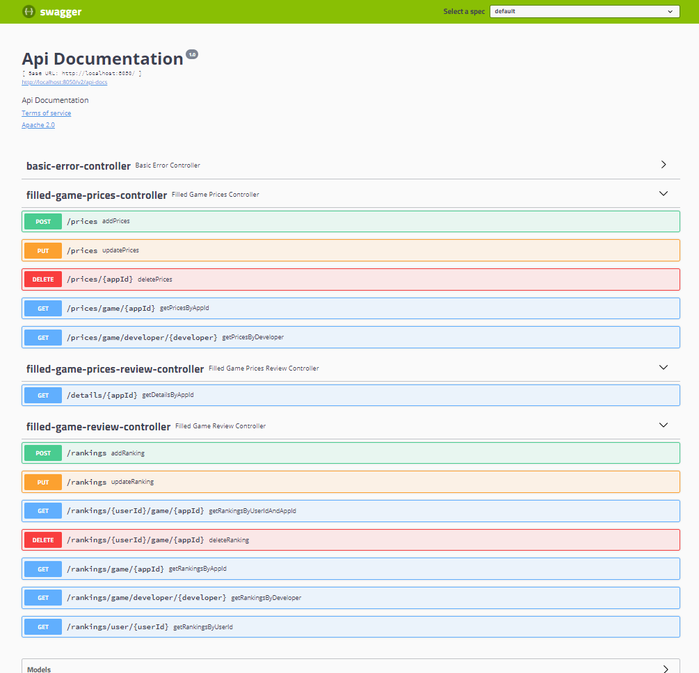

# Game Edge Service

## beschrijving

Korte beschrijving van het gekozen thema + Diagram van de volledige microservices architectuur (met links naar ‘back-end’ repo’s) op GitHub README.md van de Edge microservice

(.images/diagram)

Het gekozen thema is een game-distributieplatform (vb. Steam Store). In de back-office houden we daarom data bij voor games, reviews van gebruikers en prijzen in  verschillende valuta.

- https://github.com/m4t5k4/back-end-alfa - Games
- https://github.com/m4t5k4/back-end-beta - Reviews
- https://github.com/m4t5k4/back-end-gamma - Prices

## swagger

Volledige implementatie SwaggerUI voor de Edge microservice en screenshot(s) van de output op GitHub README.md

